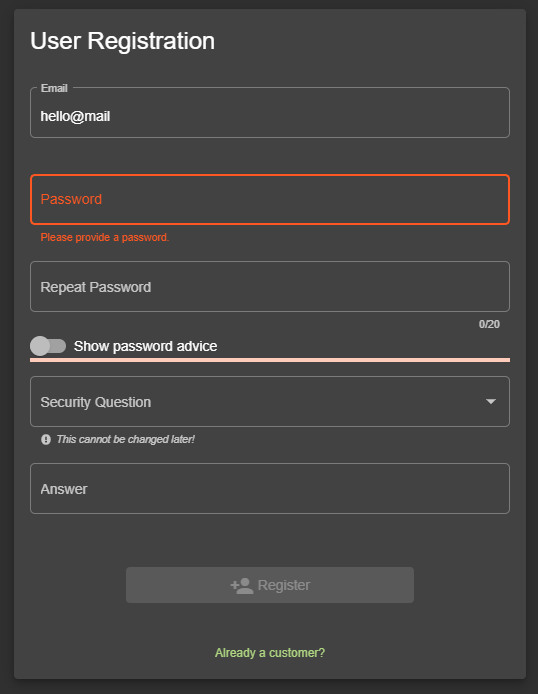
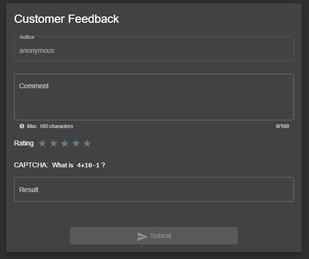

# Level 1

## Bonus Payload (XSS)
_Use the bonus payload_ 
```<iframe width="100%" height="166" scrolling="no" frameborder="no" allow="autoplay" src="https://w.soundcloud.com/player/?url=https%3A//api.soundcloud.com/tracks/771984076&color=%23ff5500&auto_play=true&hide_related=false&show_comments=true&show_user=true&show_reposts=false&show_teaser=true"></iframe>```
_in the DOM XSS challenge._

The same as _DOM XSS_ but this time it plays [OWASP Juice Shop Jingle](https://soundcloud.com/braimee/owasp-juice-shop-jingle).

## Confidential Document (Sensitive Data Exposure)
_Access a confidential document._

The usual place to check for hidden content is `/robots.txt`:
```
User-agent: *
Disallow: /ftp
```

Navigate to `/ftp` and read `acquisitions.md`.

Alternatively, run a _dir busting_ tool such as [DirBuster](https://tools.kali.org/web-applications/dirbuster).

## DOM XSS (XSS)
_Perform a DOM XSS attack with_ `<iframe src="javascript:alert(`xss`)">`.

A typical source of XSS vulnerabilities is the _search_ field. The reason is that it usually reflects the user input.
Simply paste the XSS payload into the search field.

## Error Handling (Security Misconfiguration)
_Provoke an error that is neither very gracefully nor consistently handled._

For example, navigate to `/ftp` and try reading `eastere.gg`:
```
OWASP Juice Shop (Express ^4.17.1)
403 Error: Only .md and .pdf files are allowed!
   at verify (/app/routes/fileServer.js:30:12)
   at /app/routes/fileServer.js:16:7
   at Layer.handle [as handle_request] (/app/node_modules/express/lib/router/layer.js:95:5)
   at trim_prefix (/app/node_modules/express/lib/router/index.js:317:13)
   at /app/node_modules/express/lib/router/index.js:284:7
   at param (/app/node_modules/express/lib/router/index.js:354:14)
   at param (/app/node_modules/express/lib/router/index.js:365:14)
   at Function.process_params (/app/node_modules/express/lib/router/index.js:410:3)
   at next (/app/node_modules/express/lib/router/index.js:275:10)
   at /app/node_modules/serve-index/index.js:145:39
   at FSReqCallback.oncomplete (fs.js:177:5)
```

## Exposed Metrics (Sensitive Data Exposure)
_Find the endpoint that serves usage data to be scraped by a
[popular monitoring system](https://github.com/prometheus/prometheus)._

Go to [Prometheus Docs](https://prometheus.io/docs/introduction/first_steps/#configuring-prometheus).
A quick scan reveals that the endpoint is `/metrics`.

Navigate to `/metrics`

## Missing Encoding (Improper Input Validation)
_Retrieve the photo of Bjoern's cat in "melee combat-mode"._

Go to `/#/photo-wall` and notice that the first photo is not rendered and that the `alt` text
`😼 #zatschi #whoneedsfourlegs` is shown instead. The issue is that the image `src` is not encoded. 
Encode the URL (https://www.urlencoder.org/):
```
😼-#zatschi-#whoneedsfourlegs-1572600969477.jpg --> %F0%9F%98%BC-%23zatschi-%23whoneedsfourlegs-1572600969477.jpg
```

Navigate to `/assets/public/images/uploads/%F0%9F%98%BC-%23zatschi-%23whoneedsfourlegs-1572600969477.jpg`


## Outdated Whitelist (Unvalidated Redirects)
_Let us redirect you to one of our crypto currency addresses which are not promoted any longer._

Search for `redirect` in `/main-es2015.js`. One of the results is:
```
data: {
    data: "bitcoin:1AbKfgvw9psQ41NbLi8kufDQTezwG8DRZm",
    url: "./redirect?to=https://blockchain.info/address/1AbKfgvw9psQ41NbLi8kufDQTezwG8DRZm",
    address: "1AbKfgvw9psQ41NbLi8kufDQTezwG8DRZm",
    title: "TITLE_BITCOIN_ADDRESS"
}
```
 
Go to `/redirect?to=https://blockchain.info/address/1AbKfgvw9psQ41NbLi8kufDQTezwG8DRZm`

## Privacy Policy (Miscellaneous)
_Read our privacy policy._

Log in, navigate to _Account_ / _Privacy & Security_ / _Privacy Policy_.

## Repetitive Registration (Improper Input Validation)
_Follow the DRY principle while registering a user._

Go to the _User Registration_ form (`/#/register`)



Fill the password into _Password_ and _Repeat Password_ fields.

If you change the password in the _Repeat Password_ field, the validation error `Passwords do not match` appears.
So far so good. However, if you change the password in the _Password_ field (assuming the password were the same
before the change), then the validation succeeds.

Submit the form with different passwords.

## Score Board (Miscellaneous)
_Find the carefully hidden 'Score Board' page._

View page source code to get the list of JS files. One of them is `<script src="main-es2015.js" type="module">`.

Go to `/main-es2015.js` and search for `score`. One of the results is:
```
,{path:"score-board",component:Oo},
```

Navigate to `/#/score-board`

## Zero Stars (Improper Input Validation)
_Give a devastating zero-star feedback to the store._

Navigate to _Customer Feedback_ in the top left menu.



The easiest option is to use [Edit and Resend](https://superuser.com/questions/1112057/how-to-edit-parameters-sent-through-a-form-on-the-firebug-console/1112069) feature in Firefox.

First, submit the form with an arbitrary number of stars.

Then, modify `rating` value in the request `POST /api/Feedbacks/` body like this:
```
{"UserId":18,"captchaId":4,"captcha":"-4","comment":"Hello (***njan2@mail)","rating":0}
```

Alternatively, use an intercepting proxy (such as [OWASP ZAP](https://owasp.org/www-project-zap/))
and modify the request on the fly.